# Lab 6 - Observabilidad de Microservicios con Grafana, Prometheus y Loki

**Asignatura:** Arquitecturas de Software (ARSW) - 2026-1
**Universidad:** Escuela Colombiana de Ingeniería Julio Garavito
**Autor:** Tomás Espitia
**Estado del laboratorio:** En desarrollo (avance hasta el Paso 24 de la guía - simulación de incidentes)

---

## 1. Descripción general

Este repositorio contiene el desarrollo del Lab 6 de ARSW, cuyo objetivo es construir una solución básica de observabilidad para un microservicio Spring Boot, cubriendo las tres señales principales: **métricas**, **logs** y una introducción conceptual a **trazas**.

La aplicación es un servicio de pedidos (`observability-demo`) instrumentado con Spring Boot Actuator y Micrometer, cuyas métricas son recolectadas por Prometheus, visualizadas en dashboards de Grafana, y cuyos logs son centralizados con Loki + Promtail.

No busca resolver un problema de negocio real; el `OrderController` es un servicio de prueba pensado únicamente para generar tráfico, errores y latencia de forma controlada y así poder observar el comportamiento del stack de observabilidad.

## 2. Arquitectura

```
Cliente / curl / Postman
        |
        v
Aplicación Spring Boot (puerto 8081)
  - Endpoints REST (/orders)
  - Actuator + Micrometer
  - Logs estructurados a archivo
        |
        +---- métricas ----> Prometheus (puerto 9090)
        |
        +---- logs ----> Promtail ----> Loki (puerto 3100)
                                            |
                                            v
                                     Grafana (puerto 3000)
                                     Dashboards + Explore
```

A diferencia del diagrama original de la guía, aquí la aplicación Spring Boot **corre directamente en el host (Windows, vía Maven)** y no dentro de un contenedor Docker. Esto obligó a un par de ajustes que se documentan en la sección 7 (Decisiones técnicas y adaptaciones).

## 3. Tecnologías utilizadas

| Componente | Tecnología |
|---|---|
| Lenguaje / Runtime | Java 21, Spring Boot 3.5.16 |
| Métricas | Spring Boot Actuator + Micrometer (`micrometer-registry-prometheus`) |
| Recolección de métricas | Prometheus |
| Centralización de logs | Loki + Promtail |
| Visualización | Grafana |
| Orquestación local | Docker Compose |
| Build | Maven |

## 4. Estructura del proyecto

```
TomasEspitia-Lab6-ARSW/
│
├── docker-compose.yml
├── prometheus/
│   └── prometheus.yml
├── loki/
│   └── loki-config.yml
├── promtail/
│   └── promtail-config.yml
├── logs/
│   └── observability-demo.log        (generado en tiempo de ejecución)
├── docs/
│   └── evidencias/                   (capturas de pantalla de las pruebas)
├── pom.xml
└── src/
    ├── main/
    │   ├── java/edu/eci/arsw/observability/
    │   │   ├── ObservabilityDemoApplication.java
    │   │   └── controller/
    │   │       ├── OrderController.java
    │   │       └── GlobalExceptionHandler.java
    │   └── resources/
    │       └── application.yaml
    └── test/
        └── java/edu/eci/arsw/observability/
            └── ObservabilityDemoApplicationTests.java
```

## 5. Cómo ejecutar el proyecto

### 5.1 Requisitos previos

- Java 17 o superior (se usó Java 21)
- Maven 3.8 o superior
- Docker y Docker Compose
- curl, Postman o Insomnia para probar los endpoints

### 5.2 Levantar la aplicación Spring Boot

Desde la raíz del proyecto:

```powershell
mvn spring-boot:run
```

La aplicación queda disponible en `http://localhost:8081`. Se puede validar con:

```powershell
curl http://localhost:8081/actuator/health
```

Debe responder `{"status":"UP"}`.

### 5.3 Levantar el stack de observabilidad

En otra terminal, también desde la raíz del proyecto:

```powershell
docker compose up -d
```

Esto levanta 4 contenedores:

- `arsw-prometheus` → `http://localhost:9090`
- `arsw-grafana` → `http://localhost:3000` (usuario `admin`, contraseña `admin`)
- `arsw-loki` → `http://localhost:3100`
- `arsw-promtail` (sin puerto expuesto, solo reenvía logs a Loki)

Verificar que los 4 estén corriendo:

```powershell
docker ps
```

### 5.4 Generar tráfico de prueba

Con la app y el stack corriendo, se pueden simular las tres situaciones que evalúa el laboratorio:

```powershell
# Crear un pedido
curl -X POST http://localhost:8081/orders -H "Content-Type: application/json" -d '{"customerId":"CUS-01","total":120000}'

# Consultar un pedido
curl http://localhost:8081/orders/ORD-1001

# Simular latencia (500ms - 3000ms aleatorio)
curl http://localhost:8081/orders/simulate-latency

# Simular un error 500 controlado
curl http://localhost:8081/orders/simulate-error
```

## 6. Endpoints y métricas expuestas

### Endpoints de negocio (`OrderController`)

| Método | Ruta | Descripción |
|---|---|---|
| POST | `/orders` | Crea un pedido y aumenta el contador de pedidos creados |
| GET | `/orders/{id}` | Consulta un pedido (simulado, no persiste datos) |
| GET | `/orders/simulate-latency` | Genera un delay artificial entre 500 y 3000 ms |
| GET | `/orders/simulate-error` | Lanza una excepción a propósito para observar el manejo de errores |

### Endpoints de Actuator

- `/actuator/health`
- `/actuator/info`
- `/actuator/metrics`
- `/actuator/prometheus` → endpoint que scrapea Prometheus

### Métricas personalizadas

- `orders_total` → contador de pedidos creados
- `orders_failed_total` → contador de pedidos fallidos (errores simulados)

> **Nota técnica:** en el código, el contador de pedidos creados se registró como `Counter.builder("orders_created_total")`, siguiendo el nombre exacto que pide la guía. Sin embargo, el nombre que finalmente expone Prometheus es `orders_total`, no `orders_created_total`. Esto se explica y se justifica en la sección 7.

## 7. Decisiones técnicas y adaptaciones

Durante el desarrollo surgieron algunas diferencias entre lo que indica la guía "al pie de la letra" y el comportamiento real del stack con las versiones actuales de las herramientas. Documento estas adaptaciones porque me parece importante explicar el *por qué*, no solo el *qué*:

1. **`Thread.sleep(Duration)` no compila.** La guía usa `Thread.sleep(Duration.ofMillis(delay))`, pero `Thread.sleep` no tiene una sobrecarga que reciba un `Duration`, solo `long` (milisegundos). Se corrigió a `Thread.sleep(delay)`.

2. **El contador `orders_created_total` se expone como `orders_total`.** Desde Micrometer 1.13 (el que trae Spring Boot 3.5.x por defecto), el cliente de Prometheus 1.x reserva los sufijos `.info`, `.total`, `.created` y `.bucket`. Cuando un nombre de métrica termina en `_total`, Micrometer lo elimina; y si lo que queda (`orders_created`) también termina en un sufijo reservado (`_created`), lo vuelve a eliminar, dejando solo `orders`. Como es un `Counter`, el cliente de Prometheus le agrega `_total` de nuevo al final, resultando en `orders_total`. Es un comportamiento documentado de la librería (no un error de instrumentación), así que en vez de pelear contra el framework, adapté todas las consultas PromQL posteriores (Prometheus y Grafana) para usar `orders_total`.

3. **La aplicación no corre dentro de Docker, así que Promtail no puede leer sus logs por defecto.** El `promtail-config.yml` original de la guía apunta a `/var/log/*.log` dentro del contenedor, pensado para logs de otros contenedores Docker. Como esta app corre directamente en Windows (fuera de Docker), se configuró Spring Boot para escribir sus logs a un archivo (`logging.file.name: logs/observability-demo.log`), y se montó esa carpeta como volumen del contenedor de Promtail (`./logs:/var/log/appdemo`), ajustando también el `scrape_configs` de Promtail para leer de esa ruta.

4. **`host.docker.internal` funcionó sin configuración adicional**, ya que el entorno es Windows con Docker Desktop (la guía advierte que esto puede requerir ajustes en Linux, pero no fue necesario aquí).

## 8. Evidencia de las pruebas realizadas

### 8.1 Prometheus - target activo

Confirmación de que Prometheus está scrapeando exitosamente el endpoint `/actuator/prometheus` de la aplicación:

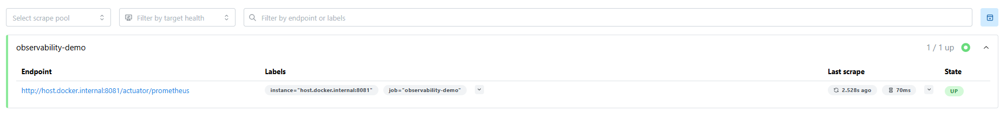

### 8.2 Dashboard de Grafana: "ARSW - Observabilidad de Microservicios"

Se construyeron los 8 paneles que pide la guía, todos usando Prometheus como fuente de datos.

**Panel 1 - Estado del servicio** (`up{job="observability-demo"}`, tipo Stat). Valor `1`, confirma que la app está disponible para Prometheus.
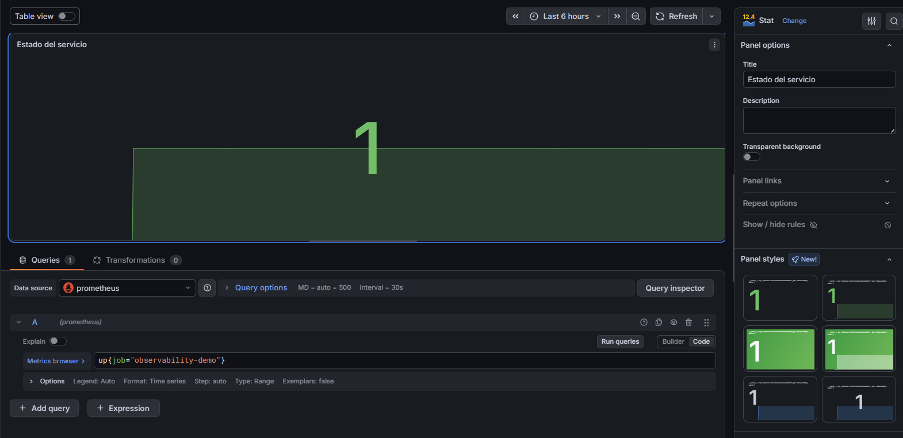


**Panel 2 - Solicitudes HTTP por endpoint** (`sum by (uri, method, status) (rate(http_server_requests_seconds_count[1m]))`, tipo Time series). Se observan picos correspondientes a las llamadas a `/actuator/health`, `/actuator/prometheus` y `/orders` (POST).

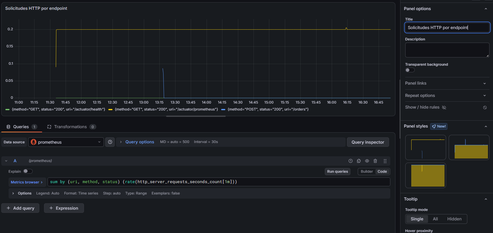

**Panel 3 - Latencia promedio** (relación entre `http_server_requests_seconds_sum` y `http_server_requests_seconds_count`, tipo Time series). Se ve un pico de ~1.4 segundos coincidiendo exactamente con una llamada a `/orders/simulate-latency`.

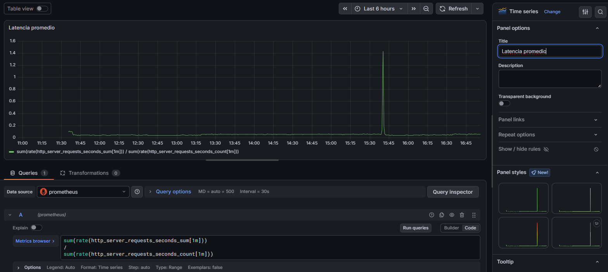

**Panel 4 - Errores HTTP 500** (`sum(rate(http_server_requests_seconds_count{status="500"}[1m]))`, tipo Time series). Pico bien definido correspondiente a las llamadas a `/orders/simulate-error`.

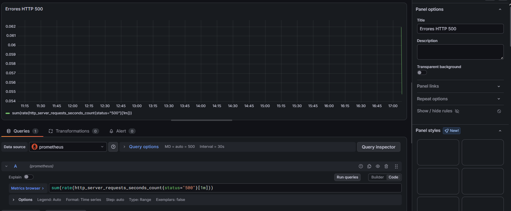
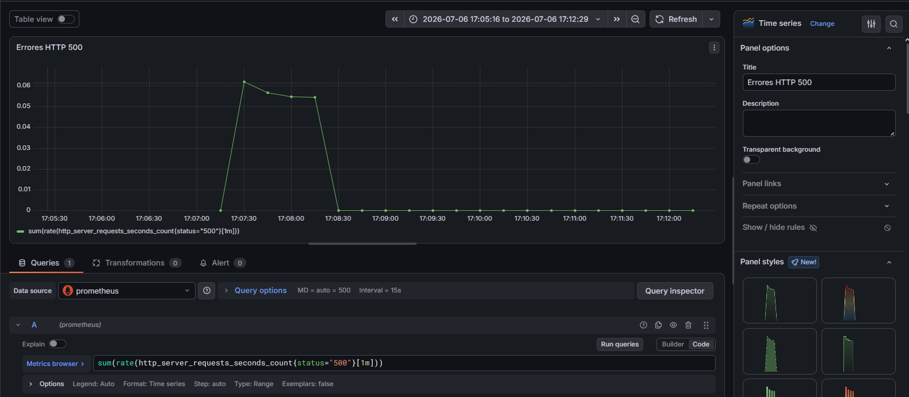

**Panel 5 - Pedidos creados** (`orders_total`, tipo Stat). Valor `5`, coincide con las 5 solicitudes POST realizadas.

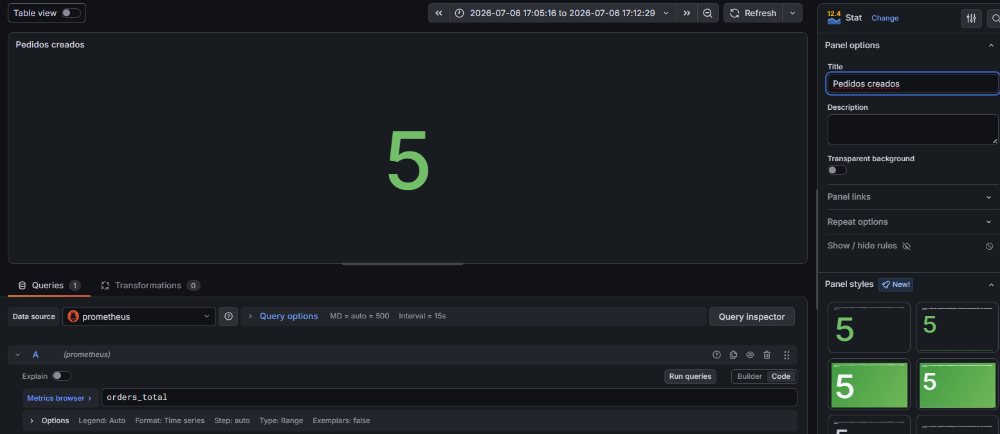

**Panel 6 - Pedidos fallidos** (`orders_failed_total`, tipo Stat). Valor `4`, coincide con las llamadas a `simulate-error`.

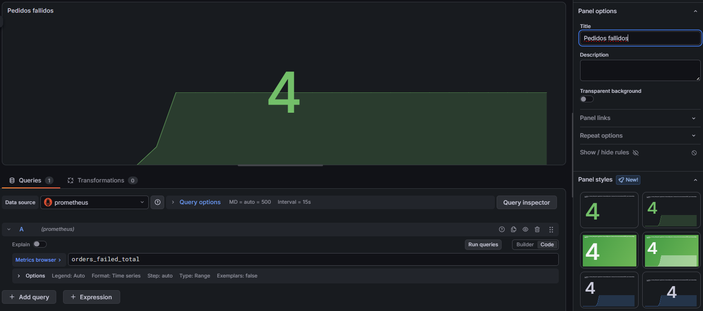

**Panel 7 - Memoria usada por JVM** (`sum(jvm_memory_used_bytes{application="observability-demo"})`, tipo Time series). Se observa el patrón "diente de sierra" típico de la JVM: la memoria sube mientras la app procesa solicitudes y cae abruptamente cuando actúa el Garbage Collector.

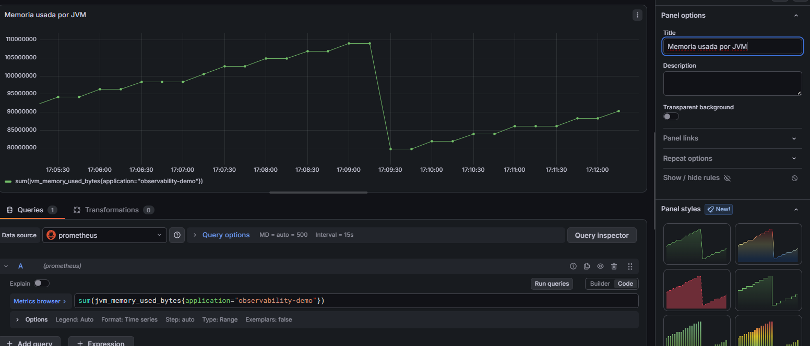

**Panel 8 - Uso de CPU del proceso** (`process_cpu_usage{application="observability-demo"}`, tipo Time series). Valores bajos (entre 0.04% y 0.2%), coherentes con una app en reposo con tráfico esporádico.

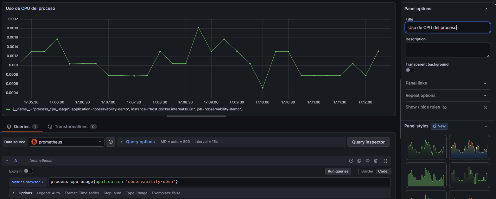

### 8.3 Exploración de logs con Loki

Todas las consultas se ejecutaron en la pestaña **Explore** de Grafana, con Loki como fuente de datos.

**Consulta base** (`{job="observability-demo"}`): trae todos los logs de la aplicación, incluyendo el stack trace completo capturado por el `GlobalExceptionHandler` al simular un error.

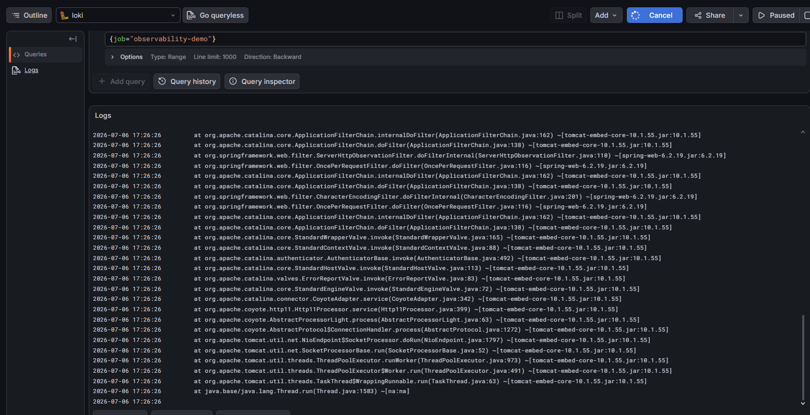

**Búsqueda de errores** (`{job="observability-demo"} |= "ERROR"`): se recuperan las 2 líneas de error esperadas — la del `GlobalExceptionHandler` y la del `OrderController`.

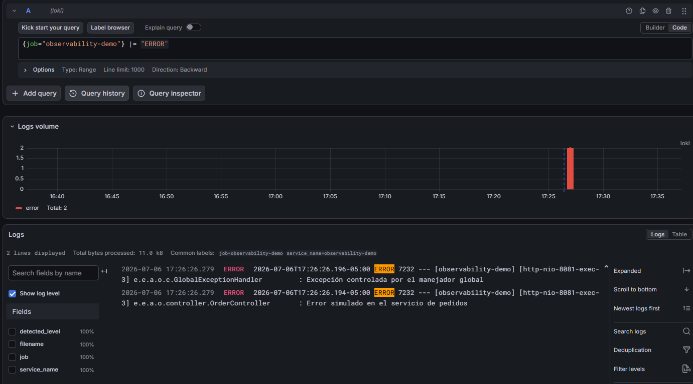

**Búsqueda por palabra "Pedido"** (`{job="observability-demo"} |= "Pedido"`): se recupera la línea "Pedido creado correctamente" con su `orderId` (UUID) asociado.

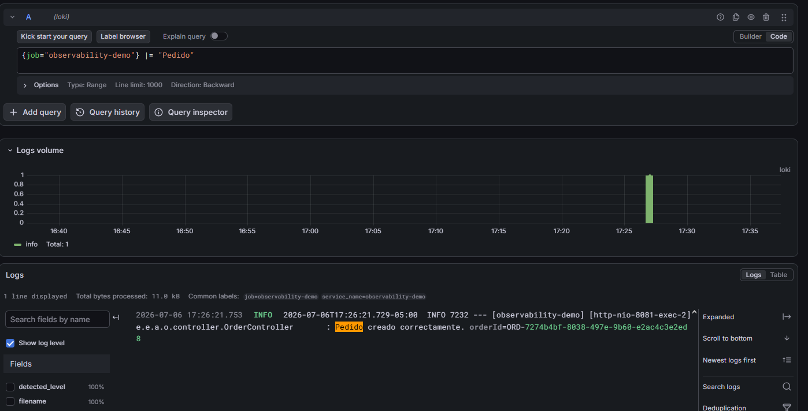

**Búsqueda por palabra "latencia"** (`{job="observability-demo"} |= "latencia"`): se recuperan las 4 líneas `WARN` de "Simulando latencia artificial", con los delays generados (827ms, 833ms, 2915ms, 1705ms), todos dentro del rango esperado (500-3000ms).

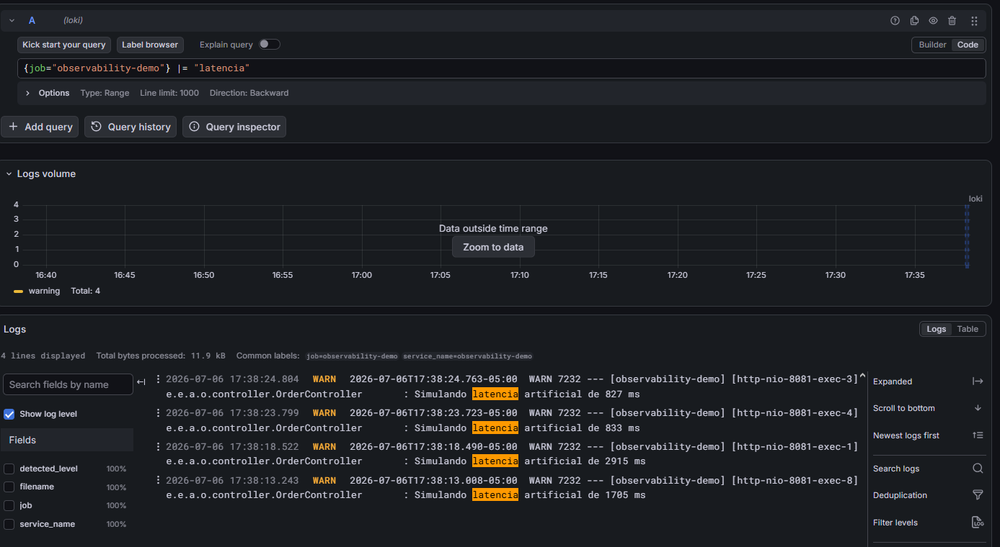

## 9. Análisis de incidentes simulados

### Incidente 1: aumento de errores

- **Endpoint que generó errores:** `/orders/simulate-error`
- **Métrica que permitió detectarlo:** `sum(rate(http_server_requests_seconds_count{status="500"}[1m]))` (Panel 4) y el contador de negocio `orders_failed_total` (Panel 6)
- **Log que explicó el error:** las líneas `ERROR` del `GlobalExceptionHandler` ("Excepción controlada por el manejador global") y del `OrderController` ("Error simulado en el servicio de pedidos")
- **Impacto para el usuario:** el cliente recibe un HTTP 500 con un mensaje genérico de error interno
- **Acción correctiva propuesta:** dado que este es un error simulado a propósito, en un caso real se recomendaría revisar el stack trace completo en Loki, correlacionarlo con el timestamp exacto del pico en el Panel 4, y verificar si el error es puntual o sostenido antes de escalar
- **Alerta que debería existir:** `sum(rate(http_server_requests_seconds_count{status="500"}[1m])) > 0` (ver sección 10)

### Incidente 2: aumento de latencia

- **Métrica que cambió:** la relación `http_server_requests_seconds_sum / http_server_requests_seconds_count` (Panel 3), con un pico de ~1.4s
- **Endpoint más lento:** `/orders/simulate-latency`
- **Log que confirma la latencia artificial:** las líneas `WARN` "Simulando latencia artificial de X ms" (sección 8.3)
- **Impacto para el usuario:** tiempos de respuesta que en el peor caso llegaron a 2915 ms, muy por encima de lo aceptable para un endpoint síncrono
- **Acción correctiva propuesta:** en un escenario real, se investigaría si la latencia proviene de una dependencia externa (base de datos, otro microservicio) usando trazas distribuidas (ver sección 11 sobre OpenTelemetry)

### Incidente 3: creación de pedidos (actividad normal de negocio)

- **Métrica que evidencia actividad de negocio:** `orders_total` (Panel 5), que pasó de 0 a 5
- **Log que permite rastrear un pedido específico:** "Pedido creado correctamente. orderId=ORD-\<uuid\>", ya que cada log incluye el identificador único del pedido
- **Información adicional que agregaría para mejorar trazabilidad:** un `correlationId` o `traceId` compartido entre todos los logs que pertenecen a una misma solicitud HTTP (hoy cada línea es independiente y solo se puede correlacionar por el `orderId` una vez que este ya fue generado). También agregaría el `customerId` como campo estructurado (no solo texto libre) para poder filtrar por cliente en Loki usando labels en vez de búsquedas de texto
